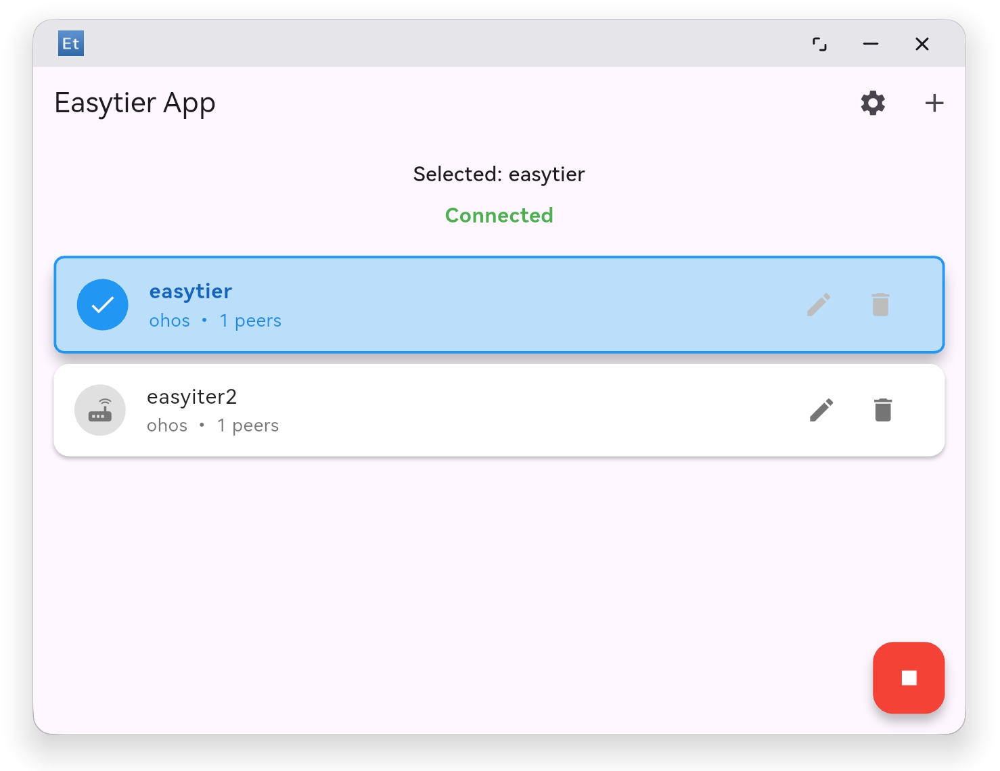

# etohos

一个基于 Flutter 的鸿蒙系统应用，用来接入 [EasyTier](https://github.com/EasyTier/EasyTier) 网络。

## 预览

 




## 开发环境

#### Flutter

```bash
git clone https://gitcode.com/openharmony-sig/flutter_flutter.git
cd flutter_flutter
git checkout 3.27.5-ohos-1.0.0
```

#### Easytier har

```bash
git clone https://github.com/EasyTier/EasyTier.git
cd EasyTier/easytier-contrib/easytier-ohrs
ohrs build --release && ohrs artifact
```
